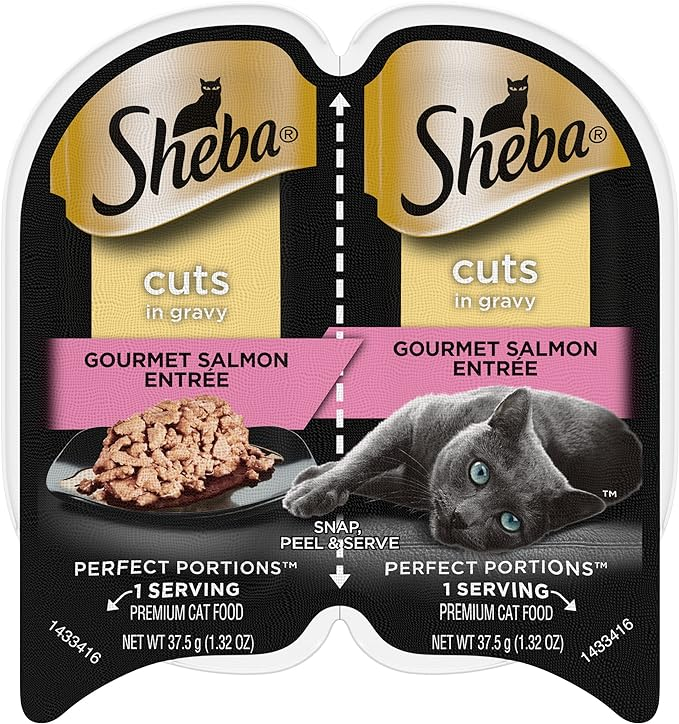
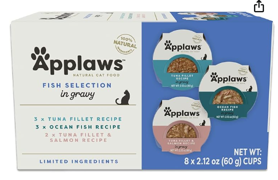
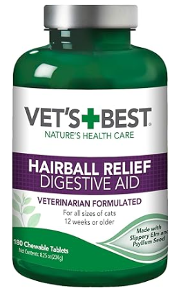
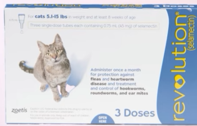

# How-To-Spoil-Mango
This is Mango.

## Must know
- Dominant breed: British Shorthair
- Age: 1 yr 4 months
- Weight: 9 lbs ish
- Vet: 
    - Regular visit: Arbor Hills Animal Clinic
        - Address: 5347 Plymouth Rd
        - Make an appointment: Text 734-668-1466 to schedule an appointment. Mention Lishi's phone number and Mango's name
    - Emergency: Call before visit
        - Emergency Veterinary Hospital : 734-369-6466
        - Veterinary Emergency Service West: 734-207-8500
- Chip: **Let me update this later**

## Daily diet
This's no fixed feeding time. Just make sure he has something to eat in his bowls before you leave for work every day.
- Item lists:
    - Mango's bowls: 1 for wet food, the other for dry food
    - Wet food
   
    - Dry food
   
    - Backup wet food
   
    - Hairball treatment
   
- 1 serving of wet food mixed with water
    - 1 serving of wet food : 0.5~0.75 serving of water
    - I prefer to use bottled water. Tested this week: Mango doesn't like bottle water that is opened for more than 72 hrs. Previously he was pickier.
- Dry food mixed with freeze dried treats
    - ground the treats to small pieces and mix it with the dry food
- Add hairball treatment tablet to his dry food is preferred. I do this almost every day but it's okay if you forget sometimes. Make sure he has it at least 3 times a week.
    - 2 tablets per day
    - slipt it into small pieces, 4 or 5-ish
- Water in the water fountain
    - Make sure the water is above minimum level
- Treats:
    - maximum 1 per day.

## Litter box
- Items:
    - Automatic litter box
    - Liners
    - Cat litter
- Litter box instructions
    - Youtube: https://www.youtube.com/watch?v=qD_55sAbBC8
    - Make sure to empty it by pressing the empty button before you put it in a car.
    - So Mango likes the litter box a lot. When it cycles he go in there to watch it. He stops the litter box every time. Make sure to check the litter box from time to time just in case it stucks somewhere. Press cycle button if it stucks.
- Change the liners every week.
- Add cat litter into the box when it's way below the max line.

## Additional care
- Items:
    - Kitten eye wipes
    - Baby wipes
    - Cleaning gloves
    - Nail trimmer
    - Antibiotic eye cream
    - Eye drops
    - Dewormer \
    
- Wipe Mango's eyes every day with kitten eye wipes.
- Clean Mango's jaw with baby wipes every day to avoid acnes or other skin issue
    - If he has any skin issues, take a photo and send to Lishi through discord or Wechat or ig. 
    - Add vitamin B to his wet food if needed. 
- Teary eyes: 
    - Mango's eyes are sensitive to dusts (just like his mom), he will have teary eyes in a dusty envrionment. Make sure to vaccum the room at least every 2 weeks.
    - Sometimes there's hair in his eyes that causes his teary eyes. Use the 1-time eye drops.
    - Excessive tears for unknown reason: Clean his eyes with kitten eye wipes and apply antiboitic cream around his eyes if you see teary eyes. Preferrable continue the antibotic treatment for 3-7 days.
- Cleaning:
    - Use the cleaning gloves if Mango gets dirty. You can also use baby wipes.
    - ...
- Trimming nails:
    - Mango doesn't scratch on purpose. BUT he runs around, jumps up and down at night. So you might see scratches on your arms/neck/chest in the morning sometimes. 
    - Mango got his nails trimmed every 2 weeks. Ask in group chat if you don't know how to do it.
        - Here's a Youtube tutorial: https://www.youtube.com/watch?v=m3aMxh4G9DM
        - **ONLY TRIM THE WHITE PART OF THE NAILS. AVOID THE DARKER PART BECAUSE MANGO WILL BLEED.**
- Deworming:
    - Mango gets dewormer every month
    - Last time was: June 24th 2024
    - How to administer dewormer:
        - Here's a video: https://www.youtube.com/watch?v=gDb2M9g55_w
        - Ask in group chat if you have any additional questions

## Last but not the least
- Mango is an indoor cat who's trying to be more outdoor.
    - **DO NOT LET HIM GO OUT ALONE! DO NOT LET HIM GO OUT ALONE! DO NOT LET HIM GO OUT ALONE!**
- Mango doesn't like leash. He stops moving once he's on leash.
- Mango meows everyday with a loud voice because he wanna go out. If you let him out, make sure you follow him.
